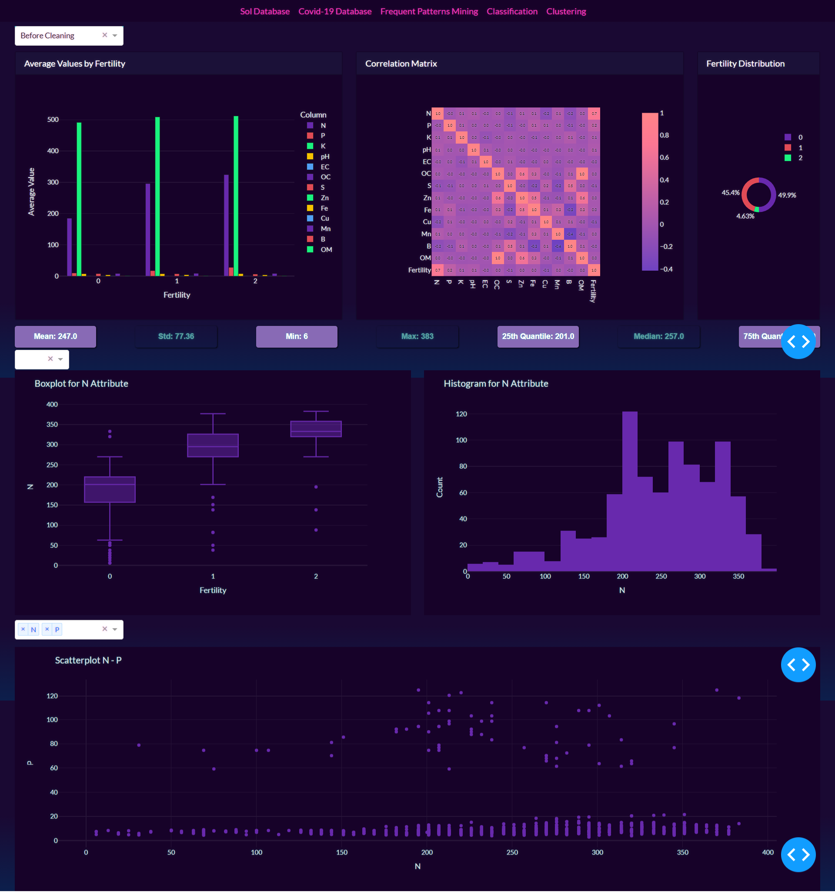
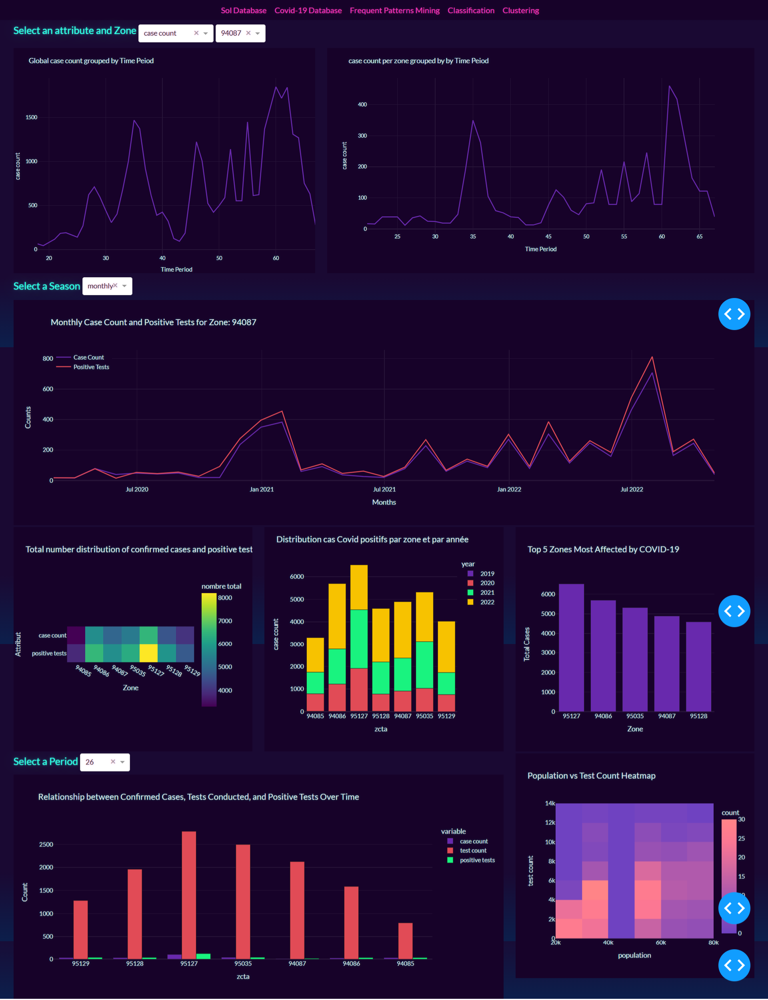
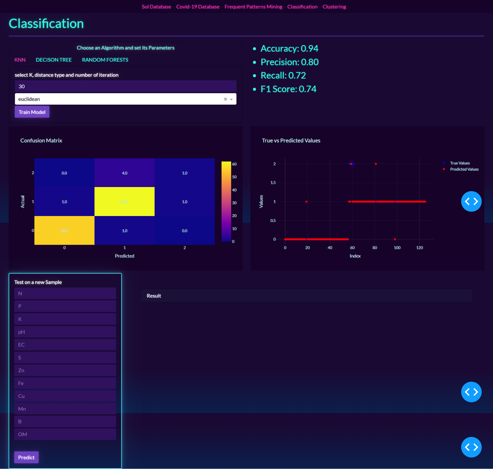
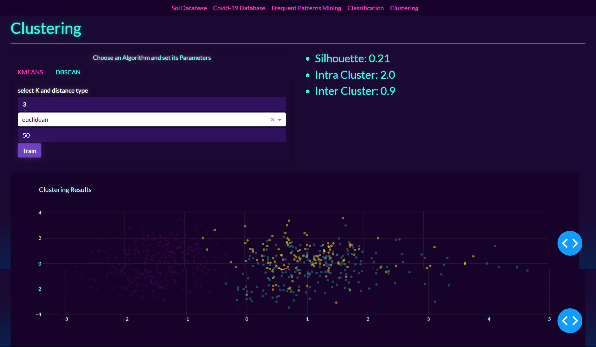
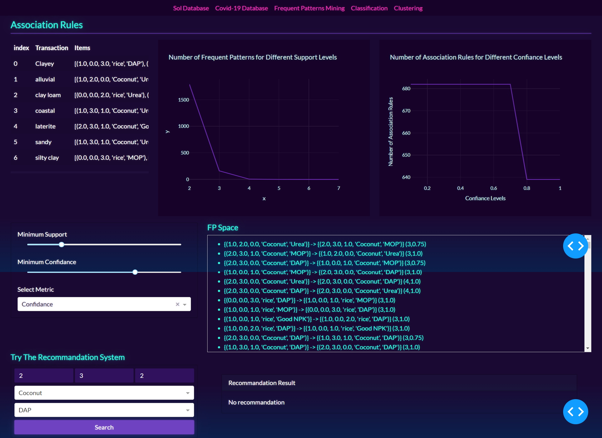

# Data Mining Dashboard Application
## Table of Contents
1. [Overview](#overview)
2. [Dashboard View](#dashboard-view)  
3. [Part 1: Data Exploration and Association Rules Extraction](#part-1-data-exploration-and-association-rules-extraction)
     - [Static Data Analysis and Visualization](#1-static-data-analysis-and-visualization)
     - [Temporal Data Analysis and Visualization](#2-temporal-data-analysis-and-visualization)
     - [Frequent Pattern Mining, Association Rules, and Correlations](#3-frequent-pattern-mining-association-rules-and-correlations)

6. [Part 2: Supervised and Unsupervised Learning](#part-2-supervised-and-unsupervised-learning)
    - [Supervised Learning](#21-supervised-learning)
    - [Unsupervised Learning](#22-unsupervised-learning)
7. [How to Run the Application](#how-to-run-the-application)

## Overview

This Data Mining Dashboard application is designed to address the challenges associated with real-world data, focusing on the analysis and extraction of association rules and application of classification and clustering algorithms. The project encompasses two datasets: a static dataset (dataset 1) containing soil property information for soil fertility analysis and a temporal dataset (dataset 2) representing the evolution of COVID-19 cases over time by postal code.

The application is built using Dash, a Python framework for creating interactive web applications, and it features machine learning algorithms and metrics coded from scratch in Python.

## Dashboard View

 

 

 

 

 

 

### Part 1: Data Exploration and Association Rules Extraction

#### 1. Static Data Analysis and Visualization
1. Import and visualize the dataset before and after preprocessing.  
2. Provide a global description of the dataset.
3. Describe each attribute.
4. Calculate measures of central tendency and infer symmetries for each attribute.
5. Build a box plot to identify outliers.
6. Construct histograms to visualize data distribution.
7. Build and display scatter plots to deduce correlations between soil properties.

#### 2. Temporal Data Analysis and Visualization
1. Display the distribution of total confirmed cases and positive tests by area (Tree Map/Bar chart).
2. Track the evolution of COVID-19 tests, positive tests, and cases over time (weekly, monthly, and yearly) for a selected area (Line chart).
3. Analyze the distribution of positive COVID-19 cases by area and year (Stacked Bar chart).
4. Graphically represent the relationship between population and the number of tests conducted.
5. Identify the top 5 areas most impacted by the coronavirus.
6. Explore the relationship between confirmed cases, tests conducted, and positive tests over time for each area.

#### 3. Frequent Pattern Mining, Association Rules, and Correlations
1. Discretize continuous climate attribute data (Temperature, Rainfall, Humidity).
2. Extract frequent patterns and association rules using the Apriori algorithm, experimenting with Min_Supp and Min_Conf values.
3. Extract strong association rules using correlation measures (lift, confidence, cosine).
4. Advanced options in the GUI:
   a. Execute the selected data mining method (Apriori).
   b. Choose Min_Supp and Min_Conf values.
   c. Insert new observations and generate recommendations.

### Part 2: Supervised and Unsupervised Learning

#### 1. Supervised Learning

1. Apply classification algorithms (KNN, Decision Trees, Random Forest) to predict soil fertility levels.  
2. Integrate algorithm execution into the GUI.  
3. Illustrate the application of the algorithms with examples.  
4. Provide confusion matrices.  
5. Evaluate and compare classification models using metrics such as accuracy, specificity, precision, recall, F-score, and average execution time.  

#### 2. Unsupervised Learning

1. Implement and test clustering algorithms (k-means, DBSCAN).  
2. Integrate algorithm execution into the GUI.   
3. Experiment with algorithm parameters.  
4. Evaluate, compare, and analyze results.  
5. Illustrate results with examples and graphs.  
6. Compare k-means and DBSCAN using appropriate metrics like inter-cluster and intra-cluster distance, silhouette, etc.  

## How to Run the Application

1. Install the required dependencies: `pip install -r requirements.txt`
2. Run the application: `python app.py`

Open your web browser and navigate to `http://localhost:8050/` to access the Data Mining Dashboard.

Feel free to explore the application, analyze datasets, and gain insights into soil properties, COVID-19 trends, and data mining results.

